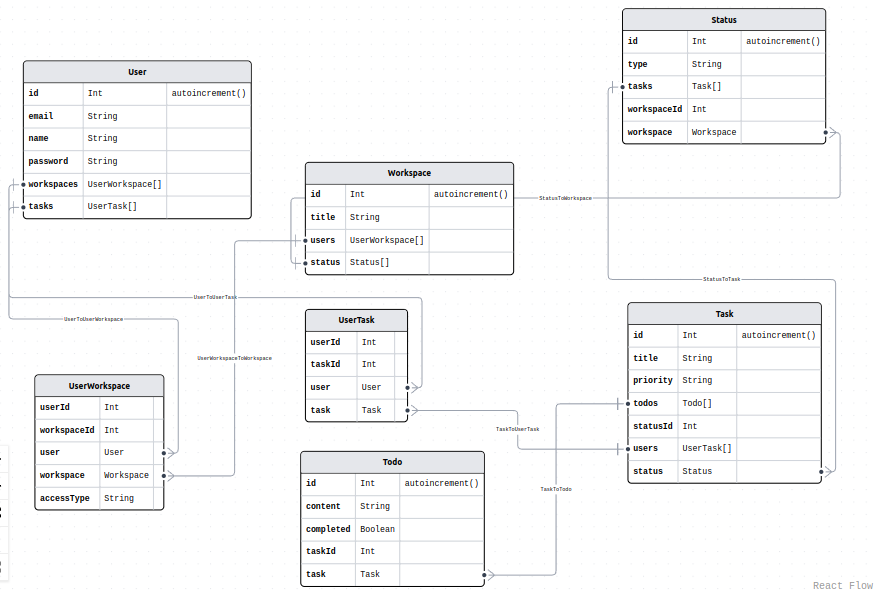

# Taskito

## 1. Introduction

Taskito is a task management web application designed to help individuals and teams organize their tasks and projects. Whether you are a busy professional or a student, this application simplifies the process of task management, allowing you to create, update, and complete tasks efficiently.

## 2. Features

- Create, update, and delete tasks
- Create, update, and delete todo items within tasks
- Mark todo items as complete or incomplete
- Assign tasks to team members and view tasks assigned to you
- User authentication and access control
- User-friendly and intuitive user interface

## 3. Database Design

## 4. Demo

https://github.com/HudaSale7/Taskito/assets/109099521/6c41846d-5032-42a4-b489-4cf1b2f61e46

## 5. Technologies

- 

- 

- 

- 

- 

- 

- 

- 

## 6. To-Do

- [ ] Drag and drop tasks
- [ ] Filter tasks
- [ ] Attach pictures to tasks
